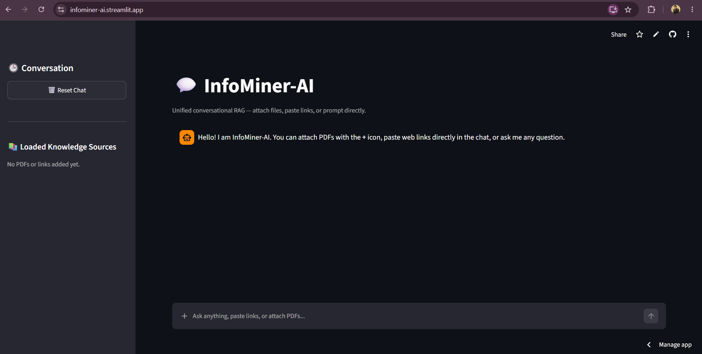

# 💬 InfoMiner-AI

InfoMiner-AI is an intelligent conversational **Retrieval-Augmented Generation (RAG)** application that allows users to interact with information from **PDF documents, web URLs, or general questions** through a unified chat interface.

Users can upload one or multiple PDF files, paste web links directly into the chat, or ask general questions. The application extracts and processes the provided information, converts it into vector embeddings, stores it in a FAISS vector database, retrieves the most relevant context, and generates an AI-powered response using a Groq-hosted language model.

---

## 🌐 Live Application

🚀 **Try InfoMiner-AI:**
https://infominer-ai.streamlit.app/

📂 **GitHub Repository:**
https://github.com/frhanahmed/InfoMiner-AI

---

## 🚀 Key Features

* **📄 PDF Document Analysis:** Upload one or multiple PDF documents directly through the chat interface and ask questions about their contents.
* **🔗 Web URL Analysis:** Paste web URLs directly into the conversation and extract information from the linked webpages.
* **🤖 AI Conversational Chat:** Ask general questions even when no external documents or URLs are provided.
* **🧠 Retrieval-Augmented Generation (RAG):** Relevant information is retrieved from the indexed documents and webpages before generating an answer.
* **🔍 Semantic Search:** User queries are matched against vector embeddings to retrieve the most relevant document chunks.
* **📚 Multiple Knowledge Sources:** PDFs and URLs can be added to the same conversation and indexed together.
* **📌 Source-Aware Responses:** When document or webpage context is used, the application keeps track of the sources used to generate the response.
* **⚡ Streaming Responses:** AI responses are streamed progressively to the interface instead of waiting for the complete response.
* **💬 Conversation History:** Previous messages are maintained during the current session to provide conversational context.
* **🗑️ Reset Chat:** Users can clear the current conversation and remove the loaded knowledge sources with a single click.
* **📋 Loaded Knowledge Sources:** The sidebar displays the PDFs and URLs currently indexed for the conversation.
* **🎯 Context-Aware Answers:** When relevant documents or webpages are available, the AI uses retrieved context to answer the user's question.
* **📊 Document Chunking:** Large documents are divided into smaller overlapping chunks before being indexed for efficient retrieval.

---

## 🧠 How It Works

InfoMiner-AI follows a RAG-based processing pipeline:

```text
             ┌──────────────────────┐
             │      User Input      │
             │                      │
             │  • PDF Upload        │
             │  • Web URL           │
             │  • General Question  │
             └──────────┬───────────┘
                        │
                        ▼
             ┌──────────────────────┐
             │   Data Extraction    │
             │                      │
             │  PDF → Text          │
             │  URL → Web Content   │
             └──────────┬───────────┘
                        │
                        ▼
             ┌──────────────────────┐
             │  Text Chunking       │
             │                      │
             │ RecursiveCharacter   │
             │ TextSplitter         │
             └──────────┬───────────┘
                        │
                        ▼
             ┌──────────────────────┐
             │    Embeddings        │
             │                      │
             │ FastEmbed / BGE      │
             │ bge-small-en-v1.5    │
             └──────────┬───────────┘
                        │
                        ▼
             ┌──────────────────────┐
             │   FAISS Vector DB    │
             │                      │
             │ Semantic Similarity  │
             │ Search               │
             └──────────┬───────────┘
                        │
                        ▼
             ┌──────────────────────┐
             │ Relevant Context     │
             │ Retrieval            │
             └──────────┬───────────┘
                        │
                        ▼
             ┌──────────────────────┐
             │   Groq LLM           │
             │ openai/gpt-oss-20b   │
             └──────────┬───────────┘
                        │
                        ▼
             ┌──────────────────────┐
             │ Streaming AI Answer  │
             └──────────────────────┘
```

---

## 🛠️ Technology Stack

### Frontend & Application Interface

* **Streamlit:** Used to build the interactive conversational web interface.
* **Python:** Core programming language powering the application.

### AI & LLM

* **Groq:** Provides the language model API used to generate AI responses.
* **`openai/gpt-oss-20b`:** Language model configured for conversational response generation through Groq.
* **LangChain:** Used for document processing, chunking, vector-store integration, and document abstractions.

### Retrieval-Augmented Generation

* **FAISS:** Vector database used to store document embeddings and perform similarity searches.
* **FastEmbed:** Used to generate semantic embeddings.
* **BAAI/bge-small-en-v1.5:** Embedding model used by the application.

### Document & Web Processing

* **PyPDF:** Extracts text from uploaded PDF documents.
* **BeautifulSoup4:** Parses and cleans HTML content retrieved from web pages.
* **Requests:** Fetches content from URLs.
* **Regular Expressions:** Detects URLs pasted into user prompts.

### Configuration

* **python-dotenv:** Loads environment variables such as the Groq API key from a `.env` file.

---

## 📸 Application Screenshots

### 💬 Main Chat Interface



The main interface provides a conversational workspace where users can ask general questions, upload PDFs, or paste URLs directly into the chat input.

### 📚 Knowledge Source Management

The sidebar displays the documents and URLs currently loaded into the application's knowledge base.

Users can also use **Reset Chat** to clear the current conversation and remove the indexed sources.

---

## 📄 PDF-Based Question Answering

Users can attach one or multiple PDF files using the **+** button in the chat input.

For example:

```text
[Attach PDF]

What is the main objective discussed in this document?
```

InfoMiner-AI extracts the text from the PDF, divides it into smaller chunks, generates embeddings, and stores those embeddings in the FAISS vector database.

The application can then retrieve the most relevant sections when answering subsequent questions.

---

## 🔗 URL-Based Information Retrieval

Users can paste a webpage URL directly into the chat.

Example:

```text
https://example.com

Summarize the important information from this webpage.
```

The application detects URLs from the user's message, retrieves the webpage content, removes unnecessary HTML elements such as scripts, styles, navigation, headers, and footers, and converts the remaining content into a searchable document.

---

## 🤖 General Conversational Questions

InfoMiner-AI can also function as a general conversational assistant.

If no PDF or URL is provided, the application sends the user's question directly to the language model.

Example:

```text
What is Retrieval-Augmented Generation?
```

This allows the application to work both as a **knowledge-based research assistant** and as a **general AI chatbot**.

---

## 🔍 RAG Pipeline

The application's RAG pipeline consists of the following major stages:

### 1. Source Detection

The application checks whether the user has:

* Uploaded PDF files
* Provided web URLs
* Asked a general question

### 2. Data Extraction

For PDFs, text is extracted page by page.

For URLs, webpage content is downloaded and cleaned before being converted into a document.

### 3. Text Chunking

Extracted documents are split into smaller sections using LangChain's `RecursiveCharacterTextSplitter`.

The application uses:

```text
Chunk Size: 750
Chunk Overlap: 100
```

### 4. Embedding Generation

Each text chunk is converted into a numerical vector representation using:

```text
BAAI/bge-small-en-v1.5
```

through FastEmbed.

### 5. Vector Storage

The generated embeddings are stored in a **FAISS vector database**.

### 6. Similarity Search

When the user asks a question, the application performs a semantic similarity search and retrieves the **top 4 relevant chunks** from the vector store.

### 7. Context Construction

The retrieved chunks are combined into a context that is passed to the language model along with the user's question and recent conversation history.

### 8. AI Response Generation

The Groq API generates the final response using the configured language model.

The response is streamed progressively into the Streamlit interface.

---

## 🏗️ Project Structure

```text
InfoMiner-AI/
│
├── app.py
│   └── Streamlit user interface and chat application
│
├── rag_engine.py
│   └── PDF/URL extraction, embeddings, FAISS retrieval,
│       and Groq-powered RAG response generation
│
├── requirements.txt
│   └── Python dependencies
│
├── .gitignore
│   └── Files and directories excluded from Git tracking
│
└── README.md
    └── Project documentation
```

---

## ⚙️ Local Installation & Setup

### 1. Prerequisites

Make sure you have the following installed:

* **Python 3.10+**
* **pip**
* **Git**

---

### 2. Clone the Repository

```bash
git clone https://github.com/frhanahmed/InfoMiner-AI.git
cd InfoMiner-AI
```

---

### 3. Create a Virtual Environment

#### Windows

```bash
python -m venv .venv
.venv\Scripts\activate
```

#### macOS / Linux

```bash
python3 -m venv .venv
source .venv/bin/activate
```

---

### 4. Install Dependencies

Install all required Python packages:

```bash
pip install -r requirements.txt
```

---

### 5. Configure the Groq API Key

Create a `.env` file in the project root directory:

```text
GROQ_API_KEY=your_groq_api_key_here
```

The application reads this environment variable when generating AI responses.

> **Important:** Never commit your `.env` file or expose your API key publicly.

---

### 6. Run the Application

Start the Streamlit application using:

```bash
streamlit run app.py
```

Streamlit will provide a local URL similar to:

```text
http://localhost:8501
```

Open the URL in your browser to start using InfoMiner-AI.

---

## 📦 Dependencies

The project uses the following major Python packages:

```text
streamlit
groq
python-dotenv
pypdf
beautifulsoup4
requests
langchain-text-splitters
langchain-community
langchain-core
fastembed
faiss-cpu
```

---

## 🔐 Environment Variables

The application requires the following environment variable:

| Variable       | Description                                    |
| -------------- | ---------------------------------------------- |
| `GROQ_API_KEY` | API key used to access the Groq language model |

Example:

```env
GROQ_API_KEY=your_api_key_here
```

---

## 🎯 Use Cases

InfoMiner-AI can be useful for:

* 📚 **Students** — Ask questions about study materials and PDFs.
* 🔬 **Researchers** — Extract and query information from research documents.
* 📑 **Document Analysis** — Quickly retrieve information from lengthy PDFs.
* 🌐 **Web Research** — Analyze information available on webpages.
* 💼 **Professionals** — Query reports, documentation, and reference material.
* 🤖 **AI Learning** — Demonstrate how a practical RAG application works.

---

## 🔮 Future Improvements

Potential improvements for future versions include:

* Persistent vector databases across application sessions
* Support for additional document formats such as DOCX and TXT
* Improved webpage extraction for JavaScript-heavy websites
* Conversation export functionality
* User authentication
* More advanced source citations
* Document preview and page navigation

---

## ⭐ Repository

If you find the project useful, consider giving the repository a ⭐ on GitHub.

**GitHub:**
https://github.com/frhanahmed/InfoMiner-AI

**Live Demo:**
https://infominer-ai.streamlit.app/
